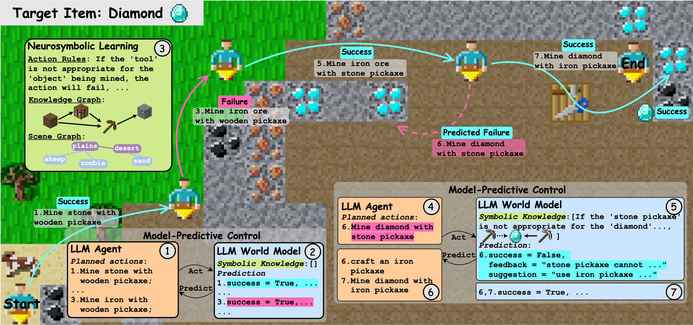

# WALL-E: World Alignment by NeuroSymbolic Learning improves World Model-based LLM Agents

[[arXiv](https://arxiv.org/abs/2504.15785)]




> WALL-E mining a diamond in Mars. Step 1-2: the agent makes decision via MPC with the initial unaligned world model, resulting in a failed action for mining iron. Step 3: leveraging previous trajectories and world model predictions, WALL-E learns symbolic knowledge, including rules, knowledge graphs, and scene graphs. Step 4-5: the learned symbolic knowledge helps the world model make accurate predictions and correct the previous mistake. Step 6-7: the agent adjusts its decision accordingly and replaces stone pickaxe with iron pickaxe toward completing the task.


## Abstract:
> Can we build accurate world models out of large language models (LLMs)? How can world models benefit LLM agents? The gap between the prior knowledge of LLMs and the specified environment's dynamics usually bottlenecks LLMs' performance as world models. To bridge the gap, we propose a training-free "world alignment" that learns an environment's symbolic knowledge complementary to LLMs. The symbolic knowledge covers action rules, knowledge graphs, and scene graphs, which are extracted by LLMs from exploration trajectories and encoded into executable codes to regulate LLM agents' policies. We further propose an RL-free, model-based agent "WALL-E" through the model-predictive control (MPC) framework. Unlike classical MPC requiring costly optimization on the fly, we adopt an LLM agent as an efficient look-ahead optimizer of future steps' actions by interacting with the neurosymbolic world model. While the LLM agent's strong heuristics make it an efficient planner in MPC, the quality of its planned actions is also secured by the accurate predictions of the aligned world model. They together considerably improve learning efficiency in a new environment. On open-world challenges in Mars (Minecraft) and ALFWorld (embodied indoor environments), WALL-E significantly outperforms existing methods, e.g., surpassing baselines in Mars by 16.1%–51.6% of success rate and by at least 61.7% in score. In ALFWorld, it achieves a new record 98% success rate after only 4 iterations.


Overview of WALL-E (Left) and NeuroSymbolic Learning details (Right). The agent determines actions to take via MPC, where an LLM optimizes future steps’ actions by interacting with a neurosymbolic world model.
WALL-E iteratively refines the symbolic knowledge with the agent’s actual trajectories in the environment and the world model predicted trajectories. The NeuroSymbolic learning takes 4 stages: (1) comparing predicted and actual trajectories; (2) learning new symbolic knowledge from real trajectories; (3) translating symbolic knowledge to code; and (4) Code rule set pruning via solving a maximum coverage problem.

<!-- ## Updates
- [09/2025] 🎉 WALL-E has been accepted to NeurIPS 2025!
- [01/2025] Released a demo for our NeuroSymbolic Learning framework. -->


## Main Results

### Mars

| MOD. TYPE     | React           | Reflexion        | Skill Library         | IfR          | WALL-E        |
|---------------|---------------|---------------|---------------|---------------|---------------|
| DEFAULT       | 7.7 ± 1.6    | 6.0 ± 1.7    | 8.0 ± 2.1    | 9.0 ± 2.3    | **9.5 ± 2.1**    |
| TERRAIN       | 7.4 ± 2.7    | 6.4 ± 3.0     | 9.5 ± 2.9 | 8.0 ± 3.7 | **10.7 ± 2.6** |
| SURVIVAL      | 6.4 ± 3.7 | 4.6 ± 3.9 | 7.9 ± 2.9 | 7.7 ± 3.7 | **13.8 ± 4.4** |
| TASK. DEP.    | 5.0 ± 2.1 | 3.2 ± 1.6 | 1.5 ± 1.9 | 5.6 ± 2.9 | **6.4 ± 2.9** |
| TERR. SURV.   | 6.7 ± 2.5 | 4.9 ± 2.5 |3.0 ± 2.5 | **6.8 ± 1.9** | 5.5 ± 2.7 |
| TERR. TASK.   | 4.8 ± 2.0 | 5.3 ± 2.5 | 5.5 ± 1.5 | **6.9 ± 1.8** | 5.8 ± 2.2 |
| SURV. TASK.   | 1.5 ± 1.3 | 1.0 ± 1.6 | 2.3 ± 1.5 | **3.3 ± 1.4** | 3.2 ± 1.4 |
| ALL THREE     | 0.7 ± 1.6 | −0.4 ± 0.7 | −0.5 ± 0.5 | 0.1 ± 0.5 | **1.3 ± 1.6** |
| AVG.          | 4.6 | 3.6 | 4.2 | 5.5 | **6.7** |

- The table shows rewards and corresponding std.
- MOD. TYPE refers to World types, including Default (original Crafter setting with no modifications), individual modifications (Terrain, Survival, Task Dependency), and combinations of two or all three modifications (Terr. Surv., Terr. Task., Surv. Task., All Three).

### ALFWorld

| Method                        | Avg. | Pick | Clean | Heat | Cool | Examine | Picktwo |
|-------------------------------|------|------|-------|------|------|---------|---------|
| BUTLER       | 26         | 31         | 41         | 60         | 27         | 12         | 29     |
| GPT-BUTLER   | 69         | 62         | 81         | 85         | 78         | 50         | 47     |
| DEPS               | 76         | 93         | 50         | 80         | **100**    | **100**    | 0      |
| AutoGen             | 77         | 92         | 74         | 78         | 86         | 83         | 41     |
| ReAct                | 74         | 79         | 54         | 96         | 85         | 83         | 51     |
| AdaPlanner          | 91         | **100**    | **100**    | 89         | **100**    | 97         | 47     |
| Reflexion          | 86         | 92         | 94         | 70         | 81         | 90         | 88     |
| RAFA                | **95**     | **100**    | 97         | 91         | 95         | **100**    | 82     |
| WALL-E (ours)                          | **98**     | **100**    | **100**        | 96    | **100**         | **100**         | 94    |
| **Human Performance**                 | 91   | -    | -     | -    | -    | -       | -       |

- The value in each cell represents the **Success Rate (%)**.
- The `-` symbol indicates no information available for those entries.

## Rule Learning Demo

The rule learning demo allows users to perform neurosymbolic learning, learning rules in natural language. You can choose to either:

1. Use an example subset of trajectories we provide for rule learning.
2. Collect and use your own trajectories from your environment for rule learning.

### Setup

Install the module dependencies into your environment:
```bash
pip install -r requirements.txt
```

### Running Rule Learning

#### Option 1: Use Provided Trajectories
We provide an example subset of trajectories for rule learning. Simply specify the path to the provided JSON file:

```bash
python run_rulelearning.py \
    --model_name gpt-4 \
    --temperature 0.5 \
    --buffer buffer_fact/traj_demo.json \
    --rule_save_dir /path/to/save/rules.json
```

#### Option 2: Collect Your Own Trajectories


If you prefer to collect your own data, gather trajectories from your environment and store them in the appropriate JSON format:

```json
{
    "action_type_1": [
        {
            "state": { /* state details */ },
            "action": { /* action details */ },
            "action_result": { /* result details */ }
        },
        {
            "state": { /* state details */ },
            "action": { /* action details */ },
            "action_result": { /* result details */ }
        }
        // More actions...
    ],
    "action_type_2": [
        // Similar structure for different action types
    ]
    // More action types...
}
```

Replace `"/path/to/your_collected_trajectories.json"` with the path to your own trajectory data:

```bash
python run_rulelearning.py \
    --model_name gpt-4 \
    --temperature 0.5 \
    --buffer /path/to/your_collected_trajectories.json \
    --rule_save_dir /path/to/save/rules.json
```


## ALFWorld

**Stage 1: NeuroSymbolic Learning** (exploration and knowledge extraction)
```bash
bash run_s1.sh
```
This stage collects trajectories, learns symbolic knowledge (rules, knowledge graphs, scene graphs), and generates executable code rules.

**Stage 2: MPC** (model-predictive control using learned knowledge)
```bash
bash run_s2.sh
```
This stage uses the learned symbolic knowledge from Stage 1 to perform MPC-based decision making.

**Note:** Stage 2 should be run after Stage 1 completes, as it relies on the symbolic knowledge learned in Stage 1.


## Mars

The backbone API model (GPT-4-32k) utilized in the Mars experiments has been discontinued. We are currently working on optimizing WALL-E's performance with the recommended replacement API model. The updated code will be released soon.
