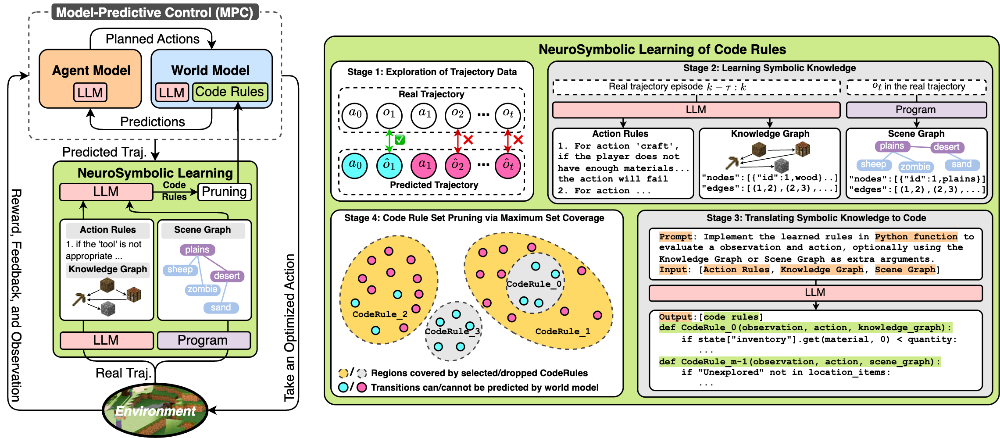

# WALL-E

**WALL-E: Rule Learning for Aligned Large Language Model World Models**

<!-- [[arXiv](https://arxiv.org/pdf/XXX)] [[code](https://huggingface.co/XXXXXX)] -->
[arXiv] [code]

## Abstract:
> Can large language models (LLMs) directly serve as powerful world models for model-based agents? While the gaps between the prior knowledge of LLMs and the specified environment's dynamics do exist, our study reveals that the gaps can be bridged by aligning an LLM with its deployed environment and such "world alignment" can be efficiently achieved by rule learning on LLMs. Given the rich prior knowledge of LLMs, only a few additional rules suffice to align LLM predictions with the specified environment dynamics. To this end, we propose a neurosymbolic approach to learn these rules gradient-free through LLMs, by inducing, updating, and pruning rules based on comparisons of agent-explored trajectories and world model predictions. The resulting world model is composed of the LLM and the learned rules. Our embodied LLM agent "WALL-E" is built upon model-predictive control (MPC). By optimizing look-ahead actions based on the precise world model, MPC significantly improves exploration and learning efficiency. Compared to existing LLM agents, WALL-E's reasoning only requires a few principal rules rather than verbose buffered trajectories being included in the LLM input. On open-world challenges in Minecraft and ALFWorld, WALL-E achieves higher success rates than existing methods, with lower costs on replanning time and the number of tokens used for reasoning. In Minecraft, WALL-E exceeds baselines by 15-30% in success rate while costing 8–20 fewer replanning rounds and only 60–80% of tokens. In ALFWorld, its success rate surges to a new record high of 95% only after 6 iterations.




Overview of WALL-E (Left) and Rule Learning details (Right). The agent's action per step is controlled by MPC, where the agent model plans actions in a look-ahead window based on the LLM+rules based world model's predictions. 
The rule learning module iteratively refines the rules by comparing the world model predicted trajectories with the agent's actual trajectories in the environment. 
The rule learning takes five steps: (1) comparing predicted and actual trajectories; (2) learning new rules from real trajectories; (3) refining learned rules; (4) translating natural language rules to code; and (5) rule set pruning via solving a maximum coverage problem. (2)-(4) are handled by LLMs, while (1) and (5) are executed by programs.


## Updates
- [2024/10] Release a Demo for Rule Learning.
- [TODO] ...

### Future Releases

The complete source code and additional features will be made publicly available upon the acceptance of our accompanying research paper. Stay tuned for updates!

## Partial Main Results

### Minecraft

| Method                      | Avg.          | Wooden        | Stone         | Iron          | Golden        | Diamond       | Redstone      |
|-----------------------------|---------------|---------------|---------------|---------------|---------------|---------------|---------------|
| GPT-3.5  | 10 (-)                | 40 (-)                | 20 (-)              | 0 (-)                 | 0 (-)                 | 0 (-)                 | 0 (-)         |
| DEPS   | 37 (35.36)            | 83 (10.67)            | 41 (33.63)          | 35 (35.27)            | 22 (45.29)            | 24 (42.46)            | 17 (45.22)    |
| GITM    | 54 (25.49)            | 96 (3.42)             | ***92*** (6.01)     | 57 (23.93)            | 39 (37.77)            | 30 (38.90)            | 22 (42.63)    |
| WALL-E w/o WM                | 61 (23.13)            | 94 (5.04)             | 89 (9.58)           | **67** (**16.58**)    | 33 (39.67)            | 43 (33.21)            | 43 (33.21)    |
| WALL-E (ours)                | **69** (**15.77**)    | **98** (**1.64**)     | 91 (**4.58**)       | 63 (19.38)            | **69** (**15.61**)    | **46** (**27.08**)    | **48** (**26.33**)    |
| **Human Performance**        | 59 (-)                | 100 (-)               | 100 (-)             | 86 (-)                | 17 (-)                | 17 (-)                | 33 (-)        |

- The first value in each cell represents the **Success Rate (%)**, and the value in parentheses represents the **Replanning Rounds**.
- The `(-)` symbol indicates no replanning round information is provided for those entries.

### ALFWorld

| Method                        | Avg. | Pick | Clean | Heat | Cool | Examine | Picktwo |
|-------------------------------|------|------|-------|------|------|---------|---------|
| BUTLER     | 26       | 31       | 41       | 60       | 27       | 12       | 29       |
| GPT-BUTLER | 69       | 67       | 83       | **100**  | 78       | 33       | 67       |
| DEPS             | 76       | 50       | **100**  | 92       | 78       | 89       | 78       |
| AutoGen            | 73       | 75       | 89       | 92       | 83       | 50       | 67       |
| ReAct              | 74       | 79       | 54       | **100**  | 78       | 54       | 67       |
| AdaPlanner         | 84       | 67       | 67       | **100**  | 78       | 88       | 71       |
| Reflexion        | 94       | 75       | **100**  | **100**  | 83       | **100**  | 83       |
| RAFA              | 90       | **100**  | **100**  | **100**  | **100**  | 83       | **100**  |
| WALL-E (ours)                         | **95**   | **100**  | **100**  | **100**  | **100**  | 88       | **100**  |
| **Human Performance**                 | 91   | -    | -     | -    | -    | -       | -       |

- The value in each cell represents the **Success Rate (%)**.
- The `-` symbol indicates no information available for those entries.

## Demo Release

The current repository includes a demo that allows users to perform rule learning, learning rules in natural language. You can choose to either:

1. Use the example trajectories we provide for rule mining.
2. Collect and use your own trajectories from your environment for rule learning.

### Setup

Install the module dependencies into your environment:
```bash
pip install -r requirements.txt
```

### Running Rule Learning

#### Option 1: Use Provided Trajectories
We provide a set of sample trajectories for rule learning. Simply specify the path to the provided JSON file:

```bash
python run_rulelearning.py \
    --model_name gpt-4 \
    --temperature 0.5 \
    --buffer buffer_fact/traj_demo.json \
    --rule_save_dir /path/to/save/rules.json
```

#### Option 2: Collect Your Own Trajectories


If you prefer to collect your own data, gather trajectories from your environment and store them in the appropriate JSON format.
Trajectories should be saved in JSON format following the structure below:

```json
{
    "action_type_1": [
        {
            "state": { /* state details */ },
            "action": { /* action details */ },
            "action_result": { /* result details */ }
        },
        {
            "state": { /* state details */ },
            "action": { /* action details */ },
            "action_result": { /* result details */ }
        }
        // More actions...
    ],
    "action_type_2": [
        // Similar structure for different action types
    ]
    // More action types...
}
```

Replace `"/path/to/your_collected_trajectories.json"` with the path to your own trajectory data:

```bash
python run_rulelearning.py \
    --model_name gpt-4 \
    --temperature 0.5 \
    --buffer /path/to/your_collected_trajectories.json \
    --rule_save_dir /path/to/save/rules.json
```


## Citation

If you use our work, please cite our paper using the following BibTeX entry:

```bibtex
@article{yourpaper2024,
  title={WALL-E: Rule Learning for Aligned Large Language Model World Models},
  author={Anonymous authors},
  journal={arXiv preprint arXiv:xxxx.xxxxx},
  year={2024}
}
```
